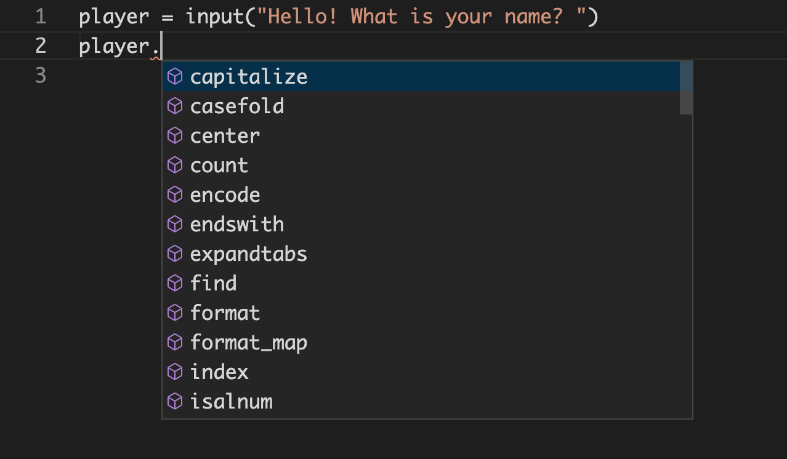
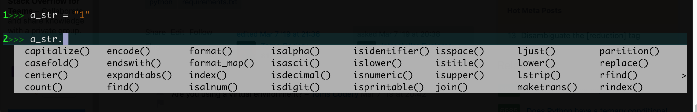

Data Types
==========

Just like any other tool, understanding what kind of data you are dealing with
at any given time means understanding what it can do and where it can go.

Think about vehicles. A pickup truck has a flatbed that is good for moving
things, whereas a minivan is better for ferrying a group of people around. A
bicycle might be a good way to get to places close to home, but you be in
trouble if you tried to take a bicycle out sailing when what you need is a
boat.

So it is with data. Every piece of data has a type and that type dictates
things like what methods and attributes it has, what functions it can be passed
to, and what other types of data it can play nicely with.

Table of Contents
-----------------

* [Classes](#classes)
   * [Exercise](#exercise)
* [Finding out the type](#finding-out-the-type)
   * [Exercise](#exercise-1)
* [What a difference a type makes](#what-a-difference-a-type-makes)
   * [Members](#members)
      * [Methods](#methods)
      * [Attributes](#attributes)
      * [Available members](#available-members)
      * [Exercise](#exercise-2)
   * [Operators](#operators)
   * [Functions](#functions)
* [Summary](#summary)
* [Reference](#reference)
   * [Glossary](#glossary)
   * [Operator dunder methods](#operator-dunder-methods)
      * [Arithmetic Operators](#arithmetic-operators)
      * [Comparison operators](#comparison-operators)
   * [See also](#see-also)

Classes
-------

In modern Python the terms {term}`type` and {term}`class` are more or less
synonymous.

A class is like a blueprint for that type. You can call a class the same way
you call a function. When you do an empty object of that type will be returned.

Lets look at what happens when we call some of the built in type classes that
we are already familiar with.

```{code-block} python
:caption: Python shell
>>> float()
0.0
>>> int()
0
>>> str()
''
>>> list()
[]
```

Classes may also take arguments. For example, most of the built in type classes
can be used to convert a value to its type. This is called {term}`typecasting`.

```{code-block} python
:caption: Python shell
>>> str(5.0)
'5.0'

>>> float(5)
5.0

>>> int(5.25)
5

>>> list("hello")
['h', 'e', 'l', 'l', 'o']
```

Not all types can be converted to all other types though.

```{code-block} python
:caption: Python shell
>>> dict(5)
---------------------------------------------------------------------------
TypeError                                 Traceback (most recent call last)
<ipython-input-29-2e3c53b6b812> in <module>
----> 1 dict(5)

TypeError: 'int' object is not iterable
```

Sometimes you may need to convert to another type first to get the desired
results. For example, lets say we want a list with all of the digits in
`32562`. An `int` cannot be converted to a `list`. Instead, convert it to a
`str` first, then convert each of the digits back to an `int`.

```{code-block} python
:caption: Python shell
>>> list(32562)
---------------------------------------------------------------------------
TypeError                                 Traceback (most recent call last)
<ipython-input-46-947a2aee1ed3> in <module>
----> 1 list(32562)

TypeError: 'int' object is not iterable

>>> str(32562)
'32562'

>>> list(str(32562))
['3', '2', '5', '6', '2']

>>> digits = list(str(32562))
>>> for i, num in enumerate(digits):
        digits[i] = int(digits[i])

>>> digits
[3, 2, 5, 6, 2]
```

### Exercise

```{exercise} classes
:label: classes-exercise

Do each of the following in a Python shell.

1. Use the type classes to create new empty objects for each of the following:
   - `bool`
   - `int`
   - `float`
   - `str`
   - `dict`
   - `list`
   - `tuple`
2. Convert data types of one type to another. Here are some
   to start with, but feel free to come up with your own
   combinations.
   - `"5"` to `int`
   - `5` to `str`
   - `5` to `bool`
   - `5` to `float`
   - `5.0` to `int`
   - `5.25` to `int`
   - `"5.25"` to `int`
   - `5` to `list`
   - `[1, 2, 3]` to `tuple`
   - `(1, 2, 3)` to `dict`
   - `{'a': '1', 'b': '2', 'c': '3'}` to `list`

```

`````{solution} classes-exercise
:class: dropdown

```{code-block} python
:caption: "#1"
>>> bool()
False

>>> int()
0

>>> float()
0.0

>>> str()
''

>>> dict()
{}

>>> list()
[]

>>> tuple()
()
```

```{code-block} python
:caption: "#2"
>>> int("5")
5

>>> str(5)
'5'

>>> bool(5)
True

>>> float(5)
5.0

>>> int(5.0)
5

>>> int(5.25)
5

>>> int("5.25")
---------------------------------------------------------------------------
ValueError                                Traceback (most recent call last)
<ipython-input-63-12a4bd2b0343> in <module>
----> 1 int("5.25")

ValueError: invalid literal for int() with base 10: '5.25'

>>> int(float("5.25"))
5

>>> list(5)
---------------------------------------------------------------------------
TypeError                                 Traceback (most recent call last)
<ipython-input-64-0c7f5cd48ec1> in <module>
----> 1 list(5)

TypeError: 'int' object is not iterable

>>> tuple([1, 2, 3])
(1, 2, 3)

>>> dict((1, 2, 3))
---------------------------------------------------------------------------
TypeError                                 Traceback (most recent call last)
<ipython-input-66-237d7a195025> in <module>
----> 1 dict((1, 2, 3))

TypeError: cannot convert dictionary update sequence element #0 to a sequence

>>> list({'a': '1', 'b': '2', 'c': '3'})
['a', 'b', 'c']
```
`````

Finding out the type
--------------------

We can find out the type of any value by using the `type()` function.

```{code-block} python
:caption: Python shell
>>> type(5)
<class 'int'>

>>> type(2.5)
<class 'float'>

>>> type("hello")
<class 'str'>
```

You can also check if a value is a particular type by using the `isinstance()`
function. The first argument is the value you want to check, and the second
argument is a type, or tuple of types, that you want to check it against.

```{code-block} python
:caption: Python shell
>>> isinstance("5", int)
False

>>> isinstance(5.0, float)
True

>>> isinstance(5, (int, float))
True
```

### Exercise

```{exercise} classes
:label: type-checking-exercise

Do each of the following in a Python shell.

1. Use the `type()` function on the following values, then come up with some of your own.
   - `False`
   - `None`
   - `"1"`
   - `5.0`
   - `[1, 2, 3]`
2. Use the `isinstance()` function to check the following, then come up with
   some of your own.
   - is `"5"` a `str`
   - is `5` an `int`
   - is `[1, 2, 3]` a `list` or a `tuple`
   - is `0` a `bool`

```

`````{solution} type-checking-exercise
:class: dropdown

```{code-block} python
:caption: "#1"
>>> type(False)
bool

>>> type(None)
NoneType

>>> type("1")
str

>>> type(5.0)
float

>>> type([1, 2, 3])
list
```

```{code-block} python
:caption: "#2"
>>> isinstance("5", str)
True

>>> isinstance(5, int)
True

>>> isinstance([1, 2, 3], (list, tuple))
True

>>> isinstance(0, bool)
False
```
`````

What a difference a type makes
------------------------------

Knowing the data type of a value will tell what it can do and where it can be
used.

To demonstrate this, lets compare an `int`, a `float` and a `str`.

```{code-block} python
>>> a_int = 1
>>> a_float = 1.0
>>> a_string = "1"
```

### Members

An object can have {term}`members <member>`, which is something that belongs
to the object and is accessed with a `.` after a value followed by the member
name. There are two kinds of members: methods and attributes.

#### Methods

A method is a just like a function, but one that is attached to an object.

Calling a method is just like calling a function, except that it goes after the
value that it belongs to with a `.` between the object and the method.

For example:

* `str` objects have a method `.isnumeric()` which returns `True` if
  all its characters numbers and `False` otherwise.
* `float` objects have a method `.is_integer()` which returns True if it is a
  whole number and `False` otherwise.
* `int` objects have a method `.bit_length()` which returns the number of bits
  needed to store the number.

```{code-block} python
:caption: Python shell
>>> a_string.isnumeric()
True

>>> a_float.is_integer()
True

>>> a_int.bit_length()
1
```

If we try to call a method on the wrong type, we'll get an error.

```{code-block} python
:caption: Python shell
>>> a_int.isnumeric()
---------------------------------------------------------------------------
AttributeError                            Traceback (most recent call last)
<ipython-input-117-789c44c0b36c> in <module>
----> 1 a_int.isnumeric()

AttributeError: 'int' object has no attribute 'isnumeric'
```

#### Attributes

{term}`Attributes <attribute>`, sometimes called properties, are just like variables, but they
are attached to an object.

For example, both `int` and `float` objects have a `.real` property.

```{code-block} python
:caption: Python shell
>>> a_float.real
1.0

>>> a_int.real
1
```

#### Available members

You can use the `dir()` function to see a list of all of a values members. (The
ones that start and end with `__` are special internal methods that are used by
Python under the hood, so you can disregard those for now.)

```{code-block} python
:caption: Python shell
>>> dir(a_int)
['__abs__',
 '__add__',
 '__and__',
 ...
 'as_integer_ratio',
 'bit_length',
 'conjugate',
 'denominator',
 'from_bytes',
 'imag',
 'numerator',
 'real',
 'to_bytes']
```

You can then use the `callable()` function to find out if a member is method
(if returns `True`) or a attribute (if it returns `False`).

```{code-block} python
:caption: Python shell
>>> callable(a_int.to_bytes)
True

>>> callable(a_int.imag)
False
```

In a Python shell you can also use the `help()` function on a type to get
detailed help on that type. You can also usually pass a value to `help()` to
get the help page for that type.

```{code-block} python
:caption: Python shell
>>> help(int)
Help on int object:

class int(object)
 |  int([x]) -> integer
 |  int(x, base=10) -> integer
 ...

>>> help(1)
Help on int object:

class int(object)
 |  int([x]) -> integer
 |  int(x, base=10) -> integer
 ...

```

In VS Code, you can hit {kbd}`⌘I` or {kbd}`⌃Space` after a variable followed by
a `.` to get a list of available members. Then you can use the {kbd}`UP` and
{kbd}`DOWN` arrows to navigate between the options and hit {kbd}`ENTER` to fill
in the selected name.



And in `ipython` you can hit {kbd}`TAB` after a variable followed by a `.` to
get a list of available members.  Then you can use the {kbd}`UP` and
{kbd}`DOWN` arrows or {kbd}`SHIFT+TAB` and {kbd}`TAB` to navigate between the
options and hit {kbd}`ENTER` to fill in the selected name.



You can use the function `hasattr()` to check if a value has a member. The
first argument is the value you want to check, the second argument is the name
of the member, a `str`.

```{code-block} python
:caption: Python shell
>>> hasattr(a_float, "is_integer")
True

>>> hasattr(a_float, "real")
True

>>> hasattr(a_str, "real")
False
```

#### Exercise

```{exercise} methods and attributes
:label: methods-and-attributes-exercise
1. In a VS Code editor, use the {kbd}`⌘I` or {kbd}`⌃Space` shortcut keys after
   an `int` variable to find the method that will return an integer ratio.
2. If you use `ipython`, use the {kbd}`TAB` key after a `float` variable to find the
   method that will return a hexadecimal representation of the number.
3. In a Python shell use the `dir()` function on a `str` value to find the method
   to right justify the string.
4. In a Python shell use the `help()` function on a `dict` type or value to
   find the method to remove specified key and return the corresponding value.
5. In a Python shell use the `hasattr()` function on a `list` value to find out
   if it has a method or attribute named `clear`.
6. In a Python shell use the `callable()` function on a `dict` value to find out
   if `values` is a method or a property.
```

### Operators

Depending on the type of an object it may have different operators available to
it, those operators may behave in different ways, and there may or may not be
other types that it can play nicely with given a particular operator.

Lets take a look at how the `+` operator works for different types.

In the case of both `int` and `float` objects, the `+` operator adds the two
numbers together. However, in the case of a `str` object, strings are
concatenated.

```{code-block} python
:caption: Python shell
>>> 1 + 1
2

>>> 1.0 + 1
2.0

>>> "1" + "1"
'11'

```

`int` and `float` objects can be used together with the `+` operator. However,
if we try to use the `+` with a `str` object and either an `int` or a `float`,
we'll get an error.

```{code-block} python
:caption: Python shell
>>> a_int + a_float
2.0

>>> a_int + a_string
---------------------------------------------------------------------------
TypeError                                 Traceback (most recent call last)
<ipython-input-133-4eab260b045c> in <module>
----> 1 a_int + a_string

TypeError: unsupported operand type(s) for +: 'int' and 'str'
```

The `/` operator isn't available for `str` object, so you'll get an error if you try.

```{code-block} python
:caption: Python shell
>>> "a, b, c" / 3
---------------------------------------------------------------------------
TypeError                                 Traceback (most recent call last)
<ipython-input-108-e172469f33c1> in <module>
----> 1 "a, b, c" / 3

TypeError: unsupported operand type(s) for /: 'str' and 'int'
```

#### Available operators

Remember those pesky `__` members we saw when using the `dir()` function? Those
are called {term}`magic <magic method>` or
{term}`dunder methods <dunder method>` and we can look at them to find out what
operators a value has.

Each operator has a cooresponding magic method. For example the `+` operator
uses the `.__add__()` method. So if `__add__` is in the list of available
members, we know that the `+` operator can be used with that value.

```{code-block} python
:caption: Python shell
:emphasize-lines: "3"
>>> dir(1)
['__abs__',
 '__add__',
 ...
 ]
```

You can look in the Reference section below to for a list of [Operator dunder
methods](#operator-dunder-methods) and the operators they coorespond to.

```{seealso}

* [Python.org > Special Method Names](https://docs.python.org/3/reference/datamodel.html#specialnames)
* [A Guide to Python's Magic Methods](https://rszalski.github.io/magicmethods/#operators)
* [Python - Dunder or Magic Methods](https://www.alphacodingskills.com/python/pages/python-dunder-methods.php)
* [Python Dunder (Special, Magic) Methods List with Tutorial](https://holycoders.com/python-dunder-special-methods/)

```

### Functions

Functions and methods often expect certian types of arguments. If you pass an
argument of the wrong type you'll get an arror.

For example, the `len()` function will accept `list` and `str` arguments, but
not `int` or `float`.

```{code-block} python
:caption: Python shell
>>> len("abc")
3

>>> len([1, 2, 3])
3

>>> len(55)
---------------------------------------------------------------------------
TypeError                                 Traceback (most recent call last)
<ipython-input-38-51e029ded84c> in <module>
----> 1 len(55)

>>> len(3.5)
---------------------------------------------------------------------------
TypeError                                 Traceback (most recent call last)
<ipython-input-35-5c30567bf151> in <module>
----> 1 len(3.5)

TypeError: object of type 'float' has no len()
```

Built-in Types
--------------

* object
  * None
  * numeric
    - float
    - int
      - bool
    - complex
  * containers, iterables
    * set
      - frozenset
    * dict
    * sequences
      - list
      - tuple
      - range
      - str
      - bytes
      - bytearray
      - memoryview
  * file (IO)

% * internal types
%   * type
%   * Ellipsis
%   * Warning
%   * Exception
%   * slice

Summary
-------

* A type or class is the classification of a value.
* When you call a class or type it returns an empty object of that type.
* You can often call a class with an argument to convert it to that type.
* You can use the `type()` and `isinstance()` functions to find out the type of a value.
* Objects can have members which are accessed by adding a `.` after the value
  followed by the member name. Members can either be attributes, which are just
  like variables, or methods which are just like functions.
* The `callable()` function will return `True` for things that can be called
  like methods, functions and classes, `False` otherwise.
* You can find out what members a value has:
  - in IPython after a variable followed by a `.` by hitting {kbd}`TAB`
  - in VS Code after a variable followed by a `.` by using the {kbd}`⌘I` or {kbd}`⌃Space` keyboard shortcuts
  - by using the `dir()` or `hasattr()` functions
* The type of a value dictates:
  - what methods and attributes are available
  - what operators it has access to and how they behave
  - which functions it can be used with

Reference
---------

### Glossary

```{glossary} data-types
attribute
property
  A variable that is attached to an object and is accessed with a `.` after a
  value followed by the member name. For example, {term}`file handler` objects
  have an attribute `.closed` which is set True if the handler is closed and
  False if it is open.

dunder method
magic method
special method
  An method, beginning and ending with two underscores (`__`) intended to be
  used internally by Python.

member
  An attribute or method attached to an object accessed with a `.` after a
  value followed by the member name

method
  A function that is attached to an object and is accessed with a `.` after a
  value followed by the member name. For example, string objects have a `.lower()`
  method which returns a copy of the string converted to lowercase.

object
  The ancestor of all types in Python.

type
data type
class
  The classification of a value which tells Python what operations can be
  performed on it. Some examples include {term}`str`, {term}`int`,
  {term}`list`, and {term}`dict`. \
  When called the type or class will return a new empty object of that
  type. For example `str()` returns `""`.

typecasting
  Converting from one type to another.
```

### Operator dunder methods

Below are tables matching operators to their cooresponding dunder methods.

#### Arithmetic Operators

| Operator | Meaning                   | Method          | Operator | Method          |
|----------|---------------------------|-----------------|----------|-----------------|
| `+`      | sum                       | `__add__`       | `+=`     | `__iadd__`      |
| `-`      | difference                | `__sub__`       | `-=`     | `__isub__`      |
| `*`      | product                   | `__mul__`       | `*=`     | `__imul__`      |
| `/`      | quotient                  | `__truediv__`   | `/=`     | `__itruediv__`  |
| `//`     | floored quotient          | `__floordiv__`  | `//=`    | `__ifloordiv__` |
| `%`      | remainder                 | `__mod__`       | `%=`     | `__imod__`      |
| `**`     | power of                  | `__pow__`       | `**=`    | `__ipow__`      |

#### Comparison operators

| Operator | Meaning                   | Method          |
|----------|---------------------------|-----------------|
| `<`      | less than                 | `__lt__`        |
| `>`      | greater than              | `__gt__`        |
| `<=`     | less than or equal to     | `__le__`        |
| `>=`     | greater than or equal to  | `__ge__`        |
| `==`     | equals                    | `__eq__`        |
| `!=`     | not equals                | `__nq__`        |
| `in`     | contains                  | `__contains__`  |

### See also

```{seealso}

- [python.org > Built-in Types](https://docs.python.org/3/library/stdtypes.html)
- [python.org > The standard type hierarchy](https://docs.python.org/3/reference/datamodel.html#types)

```

