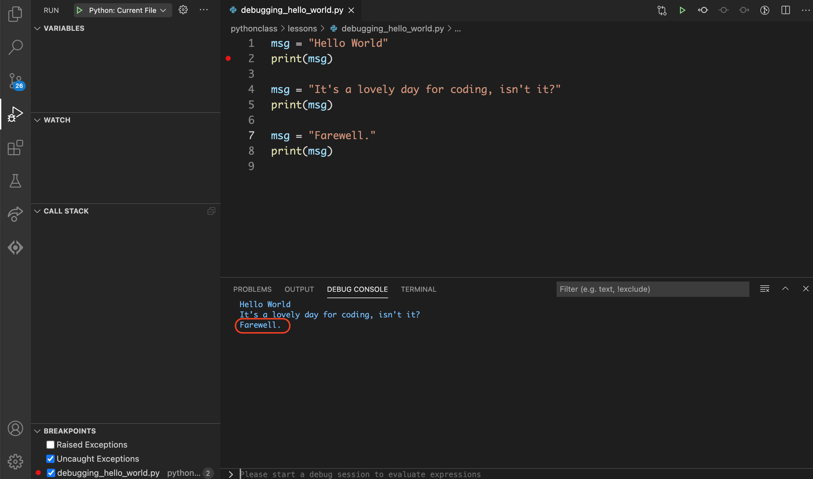
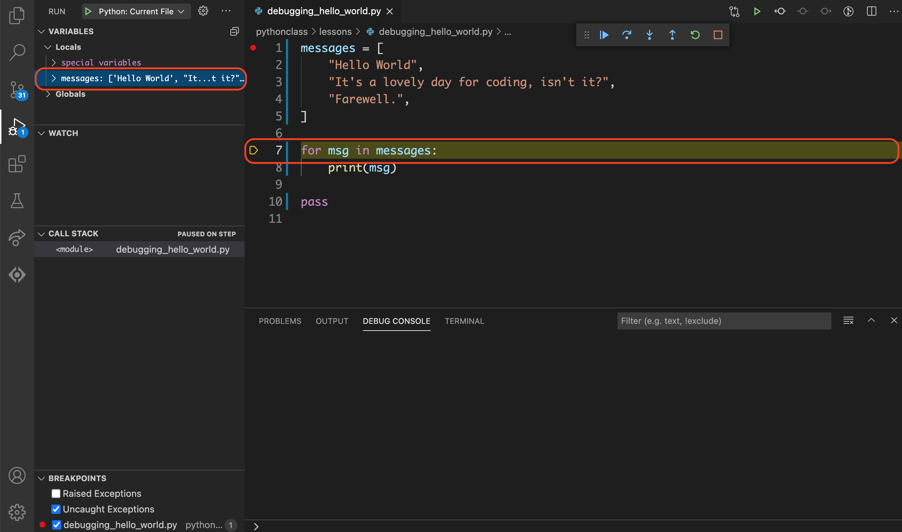
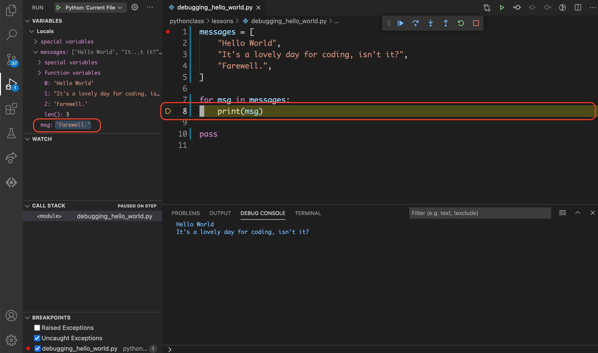

Using a Debugger
================

In the [](reading-code.md) lesson we learned how to walk through code step by
step and figure out how a line is evaluated and what the value of a variable
is are at a given point.

Thinking through code like this is a fundamental skill to develop. However,
there's also a tool that we can use to do this process called. Usually it's
used for figuring out problems in code, which is why it's called a debugger.

A debugger allows you to run a program normally until you reach a particular
point you want to know more about. Then the program is paused so you can see
what is in the scope at that point and experiment with code in the context of
that line. From there you can go forward or backwards in the code or continue
on until the next breakpoint.

Part 1: Setup
-------------

### Step 1: Create Hello World

In VS Code, create a file named {file}`hello_world.py` and paste the
following code and save it.

```{code-block} python
:linenos:
:caption: hello_world.py
msg = "Hello World"
print(msg)
```

### Step 2: Configure

The first time you run the debugger for a particular project you'll need to
configure it for that project. These settings are saved in the
{file}`.vscode/launch.json` file which can be generated for you.

I. Click the {guilabel}`Run` icon on the activity bar to show the
{guilabel}`Run` view in the sidebar.


II. Click the {guilabel}`create a launch.json file` link.


III. Select {guilabel}`Python File` from the menu that appears under the Command
Palette.


The {file}`launch.json` file will be created and opened for you.


IV. Add a comma to the end of the line that starts with `"console"`, then add a
new line `"redirectedOutput": true`.

```{code-block} javascript
:caption: launch.json
:linenos:
:emphasize-lines: 12-13
{
	// Use IntelliSense to learn about possible attributes.
	// Hover to view descriptions of existing attributes.
	// For more information, visit: https://go.microsoft.com/fwlink/?linkid=830387
	"version": "0.2.0",
	"configurations": [
		{
			"name": "Python: Current File",
			"type": "python",
			"request": "launch",
			"program": "${file}",
			"console": "integratedTerminal",
			"redirectOutput": true
		}
	]
}
```

```{warning}

The `launch.json` file is JSON, which looks a lot like Python but does have
some differences. The things you need to know for now are:

* Single quotes are not allowed for strings. Be sure to use double quotes (`"`)
  around `redirectedOutput`.
* `true` should be all lowercase, not capitalized

```

V. Save the file then close it.

Part 2: Run the debugger
------------------------

### Step 1: Add a breakpoint

The debugger will run the program normally until it hits a
{term}`breakpoint`, the place where we tell it to pause the program. Without
any breakpoints the program will run normally. So we'll start by adding a
breakpoint.

Hover over the gutter on line `2` just to the left of the line number until
you see a dim red dot. To add a breakpoint click the dot. It will change to
solid red and stay there after you move your cursor.


### Step 2: Start the debugger

```{admonition} Shortcut Key
:class: tip

| macOS      | Windows      | Command                        |
|------------|--------------|--------------------------------|
| {kbd}`F5`  |  {kbd}`F5`   | Debug: Start Debugging         |

```

I. Click the {guilabel}`Run` icon on the activity bar to open the
   {guilabel}`Run` view in the sidebar.


II. Next to the {guilabel}`Run` sidebar title you will see the launch
    configuration you just created. Click the play button to the left of
    {guilabel}`Python: Current File`.


The debugger will stop at the first breakpoint in the program. The current line
will be highlighted with a yellow arrow in the gutter.


### Step 3: Open the debug console

```{admonition} Shortcut Key
:class: tip

| macOS      | Windows      | Command                        |
|------------|--------------|--------------------------------|
| {kbd}`⇧⌘P` |  {kbd}`⇧⌃P`  | Debug Console                  |

```

If it's not already open click the {guilabel}`DEBUG CONSOLE` title in the bottom
panel.


Your program output will be shown here in addition to in the
{guilabel}`Terminal` while the debugger is running. (This behavior can be
changed via the `redirectOutput` setting in the {file}`launch.json` file.)


Part 3: Inspecting data
-----------------------

### Step 1: Variables in the sidebar

The {guilabel}`Variables` section in the sidebar is just like the Variables box
from the [](reading-code.md) lesson. It lists everything that is defined at
this point in the code execution and shows what it is set to.

In our {file}`hello_world.py` debugging seession, you can see that the `msg`
variable listed with the value of `"Hello World"`.


### Step 2: Editor hover

You can also use the editor to see the current value of a variable. If you
hover your cursor over the variable name `msg`, a tooltip will pop up showing
you its current value.


### Step 3: The debug console

Finally, you can use the {guilabel}`DEBUG CONSOLE` to get more information
about your data and more.

The {guilabel}`DEBUG CONSOLE` is where you will see your programs output if
`redirectOutput` is set in the {file}`launch.json` file.  It is also a fully
functional Python REPL that operates in the context of the current line in the
program.

At the bottom of the {guilabel}`DEBUG CONSOLE` is a prompt where you can type
input just like you would at a {command}`Python` or {command}`IPython` shell.
The results will appear in the larger area above.


Let's use this to get more information about the `msg` variable.

At the {guilabel}`DEBUG CONSOLE` prompt, type the the following commands and
then hit enter after each.

```{code-block} python
:caption: debug console prompt
msg
type(msg)
len(msg)
msg.istitle()
msg.isdigit()
```


You can also use the {guilabel}`DEBUG CONSOLE` to see available variables,
functions and methods. Suggestions will appear as you type, and you can use the
up or down arrows to scroll through the list.


Part 4: Basic stepping
----------------------

Let's learn how to use the debugger to walk through the code just like we did
in the [](reading-code.md) lesson.

### Step 4.1: Modify {file}`hello_world.py`

Let's start by adding to the {file}`hello_world.py` file so we have a little
more to work with.

Add the following to the {file}`hello_world.py` file.

```{code-block} python
:linenos:
:caption: hello_world.py
:emphasize-lines: 4-8
msg = "Hello World"
print(msg)

msg = "It's a lovely day for coding, isn't it?"
print(msg)

msg = "Farewell."
print(msg)
```

Now save the file and restart the debugger by clicking
![debug-action-restart][] on the debug toolbar or using the {kbd}`⇧⌘F5` /
{kbd}`⇧⌃F5` keyboard shortcut.

### Step 4.2: Step Into -- Line 4

For this exercise we'll be using the Step Into tool, which will step through the
code one line at a time *in the order that they are executed*. The line highlighted in the
debugger is the line that is *about* to execute.

Click ![debug-action-step-in][] on the debug toolbar or use the {kbd}`F11`
keyboard shortcut to go to the next line.

Notice that:

* Line `4` is now highlighted in the editor.
* Line `2` has been executed so the output of `Hello World` appears in the
  {guilabel}`DEBUG CONSOLE`.


### Step 4.3: Step Into -- Line 5

Click ![debug-action-step-in][] on the debug toolbar or use the {kbd}`F11`
keyboard shortcut to go to the next line.

Notice that:

* Line `5` is now highlighted in the editor.
* Line `4` has been executed so the value of the `msg` variable is now set to
  `"It's a lovely day for coding, isn't it?"` in the {guilabel}`Variables`
  section of the sidebar.


### Step 4.4: Step Into -- Line 7

Click ![debug-action-step-in][] on the debug toolbar or use the {kbd}`F11`
keyboard shortcut to go to the next line.

Notice that:

* Line `7` is now highlighted in the editor.
* Line `5` has been executed so the output of `It's a lovely day for coding, isn't it?`
  appears in the {guilabel}`DEBUG CONSOLE`.


### Step 4.5: Step Into -- Line 8

Click ![debug-action-step-in][] on the debug toolbar or use the {kbd}`F11`
keyboard shortcut to go to the next line.

Notice that:

* Line `8` is now highlighted in the editor.
* Line `4` has been executed so the value of the `msg` variable is now set to
  `"Farewell."` in the {guilabel}`Variables` section of the sidebar.


### Step 4.6: Continue

Since this is the last line of the program use Continue to finish the progam.

Click ![debug-action-continue][] on the debug toolbar or use the {kbd}`F5` keyboard
shortcut to go to continue to the end of the program.

Notice that:

* Line `8` has been executed so the output of `Farewell.` appears in the
  {guilabel}`DEBUG CONSOLE`.
* The debugger has finished.




Part 5: Steeping through loops
------------------------------

Let's see what happens when we do the same exercise, but this time with a for
loop.

### Step 5.1: Modify {file}`hello_world.py`

Let's change {file}`hello_world.py` so that it uses a for loop.

Change the {file}`hello_world.py` file so that it contains the following.

```{code-block} python
:linenos:
:caption: hello_world.py
messages = [
    "Hello World",
    "It's a lovely day for coding, isn't it?",
    "Farewell.",
]

for msg in messages:
    print(msg)

pass
```

Save the file.

### Step 5.2: Modify your breakpoints

Remove the breakpoint from line `2` then add a breakpoint to line `1`.


### Step 5.3: Run the debugger

Run the debugger by clicking ![debug-action-run][] in the **sidebar** or using the {kbd}`F5` keyboard shortcut.


### Step 5.4: Step Into -- Loop 1, Line 7

Click ![debug-action-step-in][] on the debug toolbar or use the {kbd}`F11`
keyboard shortcut to go to the next line.

Notice that:

* Line `7` is now highlighted in the editor.
* Lines `1` through `5` have been executed so the `messages` variable is now
  listed in the {guilabel}`VARIABLES` section of the sidebar.



The `messages` variable in the sidebar now has a `>` symbol to the left of it.
Click that to expand the section to see more details.


### Step 5.5: Step Into -- Loop 1, Line 8

Click ![debug-action-step-in][] on the debug toolbar or use the {kbd}`F11`
keyboard shortcut to go to the next line.

Notice that:

* Line `8` is now highlighted in the editor.
* Lines `7` has been executed so the `msg` variable is now
  listed in the {guilabel}`VARIABLES` section of the sidebar.


### Step 5.6: Step Into -- Loop 2, Line 7

Click ![debug-action-step-in][] on the debug toolbar or use the {kbd}`F11`
keyboard shortcut to go to the next line.

This time, instead of going to the next line in the file, the debugger goes to
line `7` again for the next iteration of the for loop.

Notice that:

* Line `7` is now highlighted in the editor.
* Lines `8` **from the previous loop** has been executed the output of `Hello World`
  appears in the {guilabel}`DEBUG CONSOLE`.


### Step 5.7: Step Into -- Loop 2, Line 8

Click ![debug-action-step-in][] on the debug toolbar or use the {kbd}`F11`
keyboard shortcut to go to the next line.

Notice that:

* Line `8` is now highlighted in the editor.
* Lines `7` has been executed so the `msg` variable is now
  updated in the {guilabel}`VARIABLES` section of the sidebar.


### Step 5.8: Step Into -- Loop 3, Line 7

Click ![debug-action-step-in][] on the debug toolbar or use the {kbd}`F11`
keyboard shortcut to go to the next line.

This time, instead of going to the next line in the file, the debugger goes to
line `7` again for the next iteration of the for loop.

Notice that:

* Line `7` is now highlighted in the editor.
* Lines `8` **from the previous loop** has been executed the output of `It's a lovely day for coding, isn't it?`
  appears in the {guilabel}`DEBUG CONSOLE`.

### Step 5.9: Step Into -- Loop 3, Line 8

Click ![debug-action-step-in][] on the debug toolbar or use the {kbd}`F11`
keyboard shortcut to go to the next line.

Notice that:

* Line `8` is now highlighted in the editor.
* Lines `7` has been executed so the `msg` variable is now
  updated in the {guilabel}`VARIABLES` section of the sidebar.



### Step 5.10: Step Into -- Line 10

Click ![debug-action-step-in][] on the debug toolbar or use the {kbd}`F11`
keyboard shortcut to go to the next line.

Notice that:

* Line `10` is now highlighted in the editor.
* Lines `8` **from the final loop** has been executed the output of `Farewell.`
  appears in the {guilabel}`DEBUG CONSOLE`.


:::{hint}

The `pass` statement does nothing. I added it here so we can see the last line
of the program in the debugger.

:::

---


Reference
---------

### Overview


```{table}
:class: no-headers

| Area                                  | Description                                                         |
|---------------------------------------|---------------------------------------------------------------------|
| ![][FF4014] **Debug toolbar**         | Controller for stopping, starting and stepping through the code.    |
| ![][F6EC00] **Editor**                | The editor has additonal debug features.                            |
| ![][00FCFF] **Run activity bar icon** | Button for opening the {guilabel}`Run` sidebar.                     |
| ![][BF38F3] **Run sidebar**           | Tools for managing breakpoints and inspecting data.                 |
| ![][95D360] **Debug console**         | Python REPL and program output.                                     |
| ![][00A3D7] **Debug status**          | Debugger can be started from here as well.                          |

```

[FF4014]: https://placehold.it/20/FF4014/?text=+
[F6EC00]: https://placehold.it/20/F6EC00/?text=+
[00FCFF]: https://placehold.it/20/00FCFF/?text=+
[BF38F3]: https://placehold.it/20/BF38F3/?text=+
[95D360]: https://placehold.it/20/95D360/?text=+
[00A3D7]: https://placehold.it/20/00A3D7/?text=+


### The debug toolbar

The debug toolbar is a controller widget that's usually found hovering near the
top of the editor.


```{centered} Debug Actions
```

```{table} Debug Actions
:class: no-headers

| Button                      | Shortcut                     | Name      | Action                                     |
|-----------------------------|------------------------------|-----------|--------------------------------------------|
| ![debug-action-continue][]  | {kbd}`F5`                    | Continue  | Continue to the next breakpoint.           |
| ![debug-action-step-over][] | {kbd}`F10`                   | Step Over | Go to the next line in the current scope.  |
| ![debug-action-step-in][]   | {kbd}`F11`                   | Step Into | Go to the next line to be executed.        |
| ![debug-action-step-out][]  | {kbd}`⇧F11`                  | Step Out  | Go to the line that called this function.  |
| ![debug-action-restart][]   | {kbd}`⇧⌘F5` <br> {kbd}`⇧⌃F5` | Restart   | Restart the debugger.                      |
| ![debug-action-stop][]      | {kbd}`⇧F5`                   | Stop      | Stop the debugger.                         |

```

[debug-action-run]: assets/debug-action-run.png
[debug-action-continue]: assets/debug-action-continue.png
[debug-action-step-over]: assets/debug-action-step-over.png
[debug-action-step-in]: assets/debug-action-step-in.png
[debug-action-step-out]: assets/debug-action-step-out.png
[debug-action-restart]: assets/debug-action-restart.png
[debug-action-stop]: assets/debug-action-stop.png


See Also
--------

```{seealso}

* [VS Code User Guide > Debugging](https://code.visualstudio.com/docs/editor/debugging)
* [VS Code > Python > Debugging](https://code.visualstudio.com/docs/python/debugging)

```


Glossary
--------

```{glossary} programming-concepts

breakpoint

  A place for the debugger to pause the program.

```
