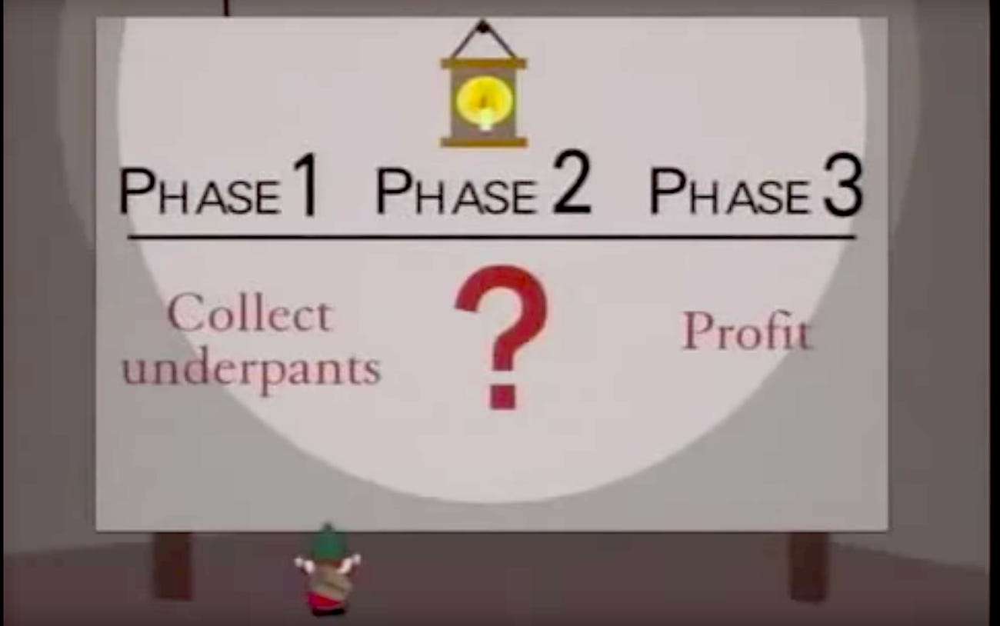

---
jupytext:
  formats: md:myst
  text_representation:
    extension: .md
    format_name: myst
kernelspec:
  display_name: Python 3
  language: python
  name: python3
---
Problem Solving
===============

The process of transforming a concept into code is the art of problem solving
and it starts before you write a single line of code.

Programming is writing out instructions for the computer. So in order for our
programs to work as expected, we must first know ourselves what it is that we
are want the computer to do.

```{epigraph}
"The hardest single part of building a software system is deciding precisely what to build."
-- Fred Brooks, The mythical man-month
  ```

```{include} ../toc.md
```

Problem solving process
-----------------------

This lesson will provide one approach to problem solving.

### 1. Define the problem

The first step is to make sure you understand the problem you are trying to
solve.

Write a short description of the problem you are trying to solve.  This will
often end up being the docstring for your script or function.

Your description should answer questions like:

- Who will use this?
- Why do they need it?
- What does it do?
- What are the inputs?
- What are the outputs?
- What are the side effects?
- What is an example of when this might be used?

Here are a couple of examples:

```{code-block} python
:caption: docstring for a hangman script
"""Hangman game

A single-user game where the player is given 6 chances to guess all of the letters in a word.
"""
```

```{code-block} python
:caption: is_prime() function with docstring including description and examples
def is_prime(number):
  """Return True if the number is a prime. Takes a positive whole number and returns True or False.

  Examples
  --------
  >>> is_prime(3)
  True

  >>> is_prime(4)
  False
  """
```

### 2. Make a plan



This is the part where you figure out how to solve the problem. You're not
writing code yet, but rather thinking it through.

Keep the plan as simple as possible while still covering all the steps. You
can drill down into each part as you go.  It is sometimes helpful to using a
pen and paper or whiteboard to sketch out a visual representation of the
problem.

For larger problems, you'll want to start by breaking it down into logical
parts. Think in terms of how it will be used.

```{code-block} text
:caption: docstring for the hangman script, now including the plan

"""Hangman game

A single-user game where the player is given 6 chances to guess all of the letters in a word.

1. choose a short word, give the player 6 chances to guess letters
2. each turn:
    - print their chances with `x` to show used chances, and `_` to show remaining
      example: `chances: xx____`
    - print the word, but replace `_` for unguessed letters
      example: `5 letters: _e___`
    - ask the player to guess a letter
3. tell the user at the end if they won or lost
"""
```

For more tightly scoped problems, solve the problem manually then describe each
step in plain English.

```{code-block} python
:caption: updated is_prime() function, now including the plan in comments
def is_prime(number):
  """Return True if the number is a prime. Takes a positive whole number and returns True or False.

  Examples
  --------
  >>> is_prime(3)
  True

  >>> is_prime(4)
  False
  """

  # iterate through each number less than the input number, starting at 2
  # for each:
      # divide the numbers
  #    - if the number is whole, return False
  # if all numbers have been iterated through without returning, return True
```

### 3. Implement

Pick a part of your plan to start at. (Sometimes it makes more sense to start
at the middle.)

#### A. Simplify

Ask yourself if this needs to be broken down further. If so, start back at at
the first step for this new problem.

Once you've got the problem broken down into a discreet chunk, simplify it if
necessary.

- Isolate it from other code by using use hardcoded placeholders. This can be
  especially helpful when other parts of the program aren't written yet, if
  you're not certain they are working, or if the data can be unpredictable.
- Solve the easiest or most normal case first.

#### B. Write pseudocode

Write a plain English description of what the code should do. This can be a
list of steps in comments. For simpler problems this may be the same as your
plan.

#### C. Write the code

Fill in the actual code under the pseudocode comments.

#### D. Verify

Make sure the code works as expected.

A few different ways to check the output:

- run your program with extra print statements
- paste the code into a shell
- write and run a test

This is where it is especially important to make sure your code is isolated. If
you have too much going on, it will be hard to figure out which part isn't working.

#### Example

Here's an example of the is_prime() function:

```{code-cell} python
---
caption: updated is_prime() function, now including plan in comments
---

def is_prime(number):
  """Return True if the number is a prime. Takes a positive whole number and returns True or False.

  Examples
  --------
  >>> is_prime(3)
  True

  >>> is_prime(4)
  False
  """

  # iterate through each number less than the input number, starting at 2
  for i in range(2, number):

    # if the number is whole, return False
      quotient = number/i

      # convert the float to an int
      # return False if the float is equal to the int
      if quotient == int(quotient):
        return False

  # if all numbers have been iterated through without returning, return True
  return True

  print("is_prime(3):", is_prime(3))
  print("is_prime(4):", is_prime(4))
```


### 4. Iterate

```{image} assets/turtles.jpg
:align: right
:target: https://en.wikipedia.org/wiki/Turtles_all_the_way_down
:alt: Turtles all the way down
:scale: 70%
```

Now that you've solved one piece of the problem, it's time to take a step back
and figure out what's next.

Focus on getting simple version of the end-to-end program working on the first
pass. Then go through and fill in more detail on each part. For example:

- handle edge cases
- make the output prettier
- fill in previously hard-coded parts
- add data validation


Example
-------

### Make lunch

```{image} assets/rosie.png
:align: right
```

Imagine that we're writing a program so that Rosie can make us a grilled cheese
sandwich. We'll use this exercise to go through the overall problem solving
exercise, but we'll skip the implementation since it's pretend.

1. Define the problem

```text
Make a grilled cheese sandwich.
```

2. Make a plan

The major steps are:

```text
1. Gather ingredients and tools
2. Assemble sandwich
3. Grill
4. Serve
```

Let's start with step 2, and drill down further.

```text
1. Gather ingredients and tools
2. Assemble sandwich
    - slice cheese
    - butter the bread
    - combine bread and cheese

3. Grill
4. Serve
```
Next let's move onto grilling the sandwich.

```text
1. Gather ingredients and tools
2. Assemble sandwich
    - slice cheese
    - butter the bread
    - combine bread and cheese

3. Grill
  - heat skillet on stovetop
  - place sandwich in skillet
  - grill until lightly brown
  - flip over
  - grill until lightly brown and cheese is melted

4. Serve
```

Now let's go onto serving the sandwich.

```text
1. Gather ingredients and tools
2. Assemble sandwich
    - slice cheese
    - butter the bread
    - combine bread and cheese

3. Grill
    - heat skillet on stovetop
    - place sandwich in skillet
    - grill until lightly brown
    - flip over
    - grill until lightly brown and cheese is melted

4. Serve
    - move sandwich from skillet to plate
    - move plate to table
```

Now that the rest is filled in, it's easier to figure out what needs to happen in step 1.

```text
1. Gather ingredients and tools
     - Get butter and cheese from fridge.
     - Get bread from cupboard.
     - Get skillet from cabinet.
     - Get butter knife and cheese knife from utensil drawer.
     - Get plate from cabinet.

2. Assemble sandwich
    - slice cheese
    - butter the bread
    - combine bread and cheese

3. Grill
    - heat skillet on stovetop
    - place sandwich in skillet
    - grill until lightly brown
    - flip over
    - grill until lightly brown and cheese is melted

4. Serve
    - move sandwich from skillet to plate
    - move plate to table
```

You might do more iterations now. For example, perhaps you might add a "Preheat
the stove" to step 1. Or specify the number and size of slices in step 2. Or
approximate time and heat level in step 3.

Exercises
---------

```{exercise}

1. Write a function that returns True if a word is a palindrome.
2. Write a function that will return a letter grade when given a number.
3. Write a function to calculate the tip for a bill.

```


::::{seealso}

* [The Beginner Programmer's guide to Problem Solving](https://www.codeproject.com/tips/833768/the-beginner-programmers-guide-to-problem-solving)
* [10 Steps to Solving a Programming Problem](https://codeburst.io/10-steps-to-solving-a-programming-problem-8a32d1e96d74)
* [The best programming problem solving technique](https://www.jesuisundev.com/en/problem-solving/)

::::

