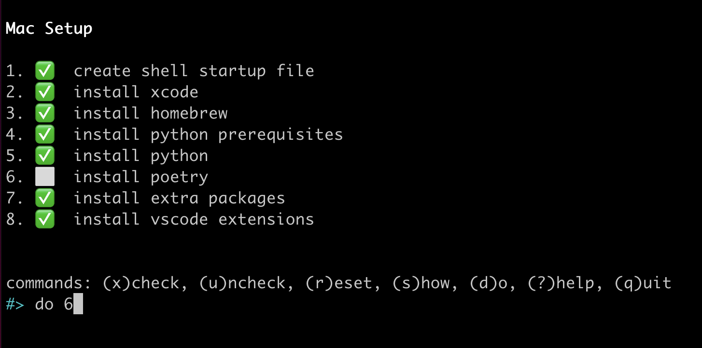

Mac Dev Env for Python
======================

Mac tool recommendations and setup guide for Python development.


```{contents} Table of Contents
:backlinks: entry
:local:
```

Quickstart
----------

The [Python Class Setup][setup-tool] tool will guide you step-by-step through
the setup process.

```bash
[[ -d ~/.setup ]] || git clone https://github.com/alissa-huskey/python-class-setup.git ~/.setup
cd ~/.setup
./bin/setup-mac
```



[setup-tool]: https://github.com/alissa-huskey/python-class-setup


Steps
-----

### Step 1: XCode

XCode is the Apple IDE (integrated development environment), a tool for writing
code. It also contains the foundational tools and libraries that other programs
rely on, and that programmers use when writing code.

:::{warning}

This step will take awhile, so it's a good idea to do this before bed or something.

:::

Run the following command at the command line. Some GUI windows will pop up,
prompting you to log into your apple account and accept the terms of service.
After you follow the prompts, the download and installation will begin.

```{code-block} bash
:caption: command line
xcode-select --install
```

When it finishes run the following to accept the license.

```bash
sudo xcodebuild -runFirstLaunch
```

If installing from the command line does not work for some reason, you can
install XCode via the Apple App Store.

### Step 2: Find/create your startup file

`````{tip}

You can run the `make-shellrc` tool to find and generate a startup file for
you. 

Copy the following and paste it into a terminal:

```bash
[[ -d ~/.setup ]] || git clone https://github.com/alissa-huskey/python-class-setup.git ~/.setup
cd ~/.setup
./bin/make-shellrc
```

`````

Every time a terminal session starts, your shell reads from various files. One
of those files is in your home directory and is where you will put
configuration for things we'll install in some of the following steps.

First you need to find out what your shell is by typing:

```bash
echo $SHELL
```

You will most likely see either `/bin/zsh` or `/bin/bash`. 

Next we need to create your startup file if it does not already exist.

* If your shell is `/bin/zsh`, your startup file is `~/.zshrc`.
* If your shell is `/bin/bash`, your startup file is `~/.bash_profile`.

```bash
[[ "${SHELL}" =~ zsh$ ]] && initfile=$HOME/.zshrc
[[ "${SHELL}" =~ bash$ ]] && initfile=$HOME/.bash_profile

touch "${initfile}"
```

In later steps when you see `initfile`, be sure to replace with the path to
your file.


### Step 3: Homebrew

Homebrew is a package manager for macOS.  It simplifies the installing,
upgrading and uninstalling of software, especially tools used by developers.

We'll use this to install software in future steps.

```bash
/bin/bash -c "$(curl -fsSL https://raw.githubusercontent.com/Homebrew/install/master/install.sh)"
```

If you have an M1 chip, you will also need to add the following to your startup
file.

```bash
PATH="/opt/homebrew/bin:$PATH"
export PATH
```

See the [homebrew guide](homebrew.md).

### Step 4: asdf

asdf is a command line tool that lets you easily install and switch between
multiple versions of Python or other languages.

```{code-block} bash
:caption: command line

# install asdf
brew install asdf
```

Then you'll need to add the following line to your startup file:

```bash
source "$(brew --prefix asdf)/libexec/asdf.sh"
```

% See the [asdf guide](asdf.md).

```{seealso}

* [asdf docs](https://asdf-vm.com/manage/core.html)
* [github repo](https://github.com/asdf-vm/asdf)
* [python plugin](https://github.com/danhper/asdf-python)
* [asdf plugin repo](https://github.com/asdf-vm/asdf-plugins)

```

### Step 5: Python

> This is for installing Python 3.8, but feel free to replace `3.8.11` with any
> version in `asdf list all python`.

```bash
# install prerequisites
brew install zlib openssl readline xz bzip2 asdf

# install python
asdf install python 3.8.11
asdf global python 3.8.11
```

#### Troubleshooting

##### Issue: arm64-apple not recognized

The install fails before building with the error

    Invalid configuration arm64-apple-darwin21.3.0: machine arm64-apple not recognized

:::{dropdown} Error
:title: card-title

```
BUILD FAILED (OS X 12.2.1 using python-build 2.2.4-1-6-g44db3b03)

Inspect or clean up the working tree at /var/folders/jg/spf3ymn14710q5h5bl7p3wlw0000gn/T/python-build.20220304160204.18295
Results logged to /var/folders/jg/spf3ymn14710q5h5bl7p3wlw0000gn/T/python-build.20220304160204.18295.log

Last 10 log lines:
/var/folders/jg/spf3ymn14710q5h5bl7p3wlw0000gn/T/python-build.20220304160204.18295 ~
/var/folders/jg/spf3ymn14710q5h5bl7p3wlw0000gn/T/python-build.20220304160204.18295/Python-3.8.11 /var/folders/jg/spf3ymn14710q5h5bl7p3wlw0000gn/T/python-build.20220304160204.18295 ~
checking build system type... Invalid configuration `arm64-apple-darwin21.3.0': machine `arm64-apple' not recognized
configure: error: /bin/sh ./config.sub arm64-apple-darwin21.3.0 failed
make: *** No targets specified and no makefile found.  Stop.
```

:::

:::{dropdown} Solution
:open:

This happens on macs with the M1 chip when the the GNU version of `uname`
(from the `coreutils` homebrew package) is installed.

There is a patch for this that can be applied on install.

`````{tabbed} asdf

Apply the patch by setting the `ASDF_PYTHON_PATCH_URL` environment variable.

```{code-block} bash
:caption: Command line
export ASDF_PYTHON_PATCH_URL="https://gist.githubusercontent.com/xight/74f84b8bde9ac6f539c3db20c2897d46/raw/cf2fd7ff5572afafb54d062f866e40d5e65cab43/config-sub.patch"
asdf install python 3.8.11
```

`````

`````{tabbed} pyenv

Apply the patch using the --patch flag.

```{code-block} bash
:caption: Command line
pyenv install --patch 3.8.11 < \
  <(curl -sSL https://gist.githubusercontent.com/xight/74f84b8bde9ac6f539c3db20c2897d46/raw/cf2fd7ff5572afafb54d062f866e40d5e65cab43/config-sub.patch)
```

`````

:::

:::{seealso}

* [python bug report](https://bugs.python.org/issue43878)
* [pull request](https://github.com/python/cpython/pull/25450/files#diff-9c966208fd0a0c8e24a1526da6904887c378283b9b645b9740c19339884174d9R1107)
* [patch](https://gist.githubusercontent.com/xight/74f84b8bde9ac6f539c3db20c2897d46/raw/cf2fd7ff5572afafb54d062f866e40d5e65cab43/config-sub.patch)

:::

### Step 6: Poetry

Poetry is a tool that helps you make keep track of and install the dependencies
needed for each project.

This step is optional.

To install poetry run the following:

```bash
curl -sSL https://install.python-poetry.org | python3 -
```

Then add to your startup file:

```bash
PATH="$HOME/.poetry/bin:$PATH"
export PATH
```

See the full [Poetry Guide](poetry.md).

### Step 7: VS Code

Install Visual Studio Code via homebrew:

```bash
brew install --cask visual-studio-code
```

Or you can [download][vscode-download] the package from the Visual Studio Code website.

See the [VS Code Intro](vscode.md).

[vscode-download]: https://code.visualstudio.com/#alt-downloads

### Step 8: VS Code extensions

You can install the recommended extensions via the [PythonClass][vscode-ext] extension.

[vscode-ext]: https://marketplace.visualstudio.com/items?itemName=alissahuskey.vscode-python-class

```bash
code --install-extension alissahuskey.vscode-python-class
```


% #### TODO

% * `[ ]` .zshrc / .bashrc
% * `[ ]` .env
