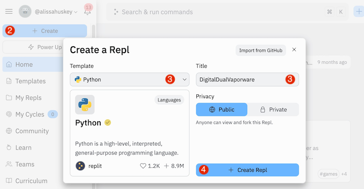
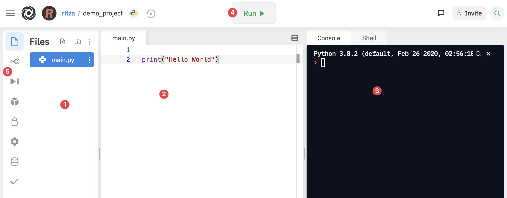
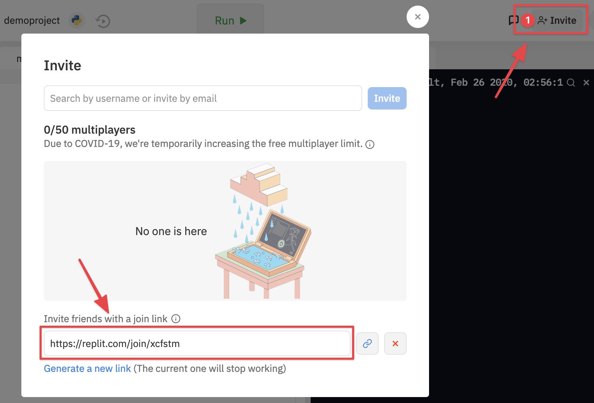
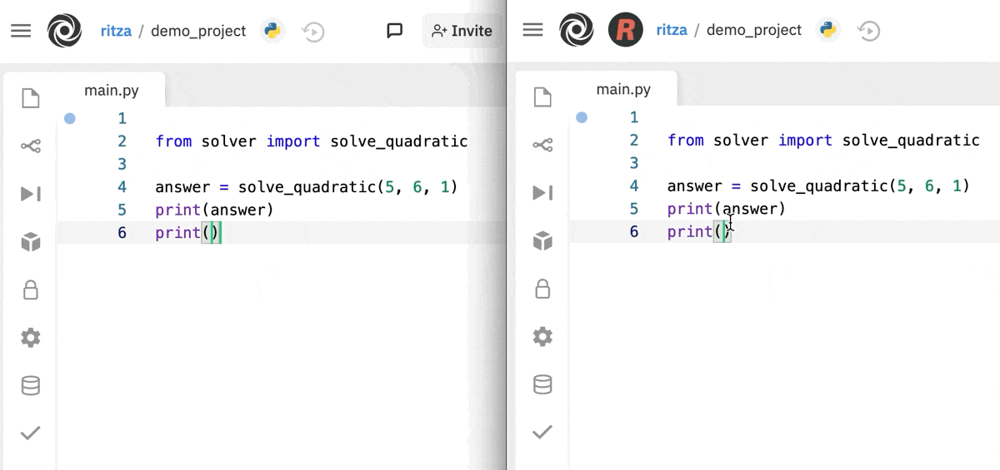
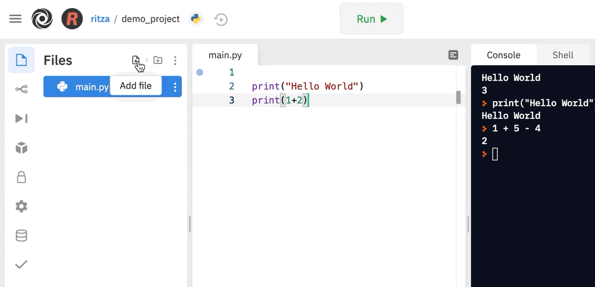

---
myst:
  substitutions:
    fork: '{fas}`code-fork;sd-text-primary`'

jupytext:
  formats: md:myst
  text_representation:
    extension: .md
    format_name: myst
kernelspec:
  display_name: Python 3
  language: python
  name: python3
---
Replit
======

```{image} assets/replit-logo.svg
:align: center
```

[Replit][] is a fast and free way to get you up and running with a
{term}`development environment`, a place to write and execute code. It
provides all the tools you need to create Python programs right from your web
browser.

It avoids a lot of the typical pain of setting up a coding environment and it
is also cloud based so you can log in from any computer to view your code.
Additionally, it provides tools for real-time collaboration which can be used
for coding lessons, demos, feedback, and getting help with your code.

```{include} ../toc.md
```

Part 1: Getting Started
-----------------------

### Part 1.1: Prerequisites

Since Replit is a web application it won't matter whether you have a Mac or
Windows or even Linux computer. You won't need to install or set up anything on
your local computer.

All you need is a computer with:

* a decent internet connection
* a modern web browser ([Chrome][] recommended, or [Brave][] if you care about privacy)
* a physical keyboard

[Chrome]: https://www.google.com/chrome/
[Brave]: https://brave.com/

### Part 1.2: Sign up

1. Go to [Replit][replit] and create an account. *NOTE: You will have to check your
   email and activate your account before you can sign in.*
2. Once you have confirmed your email and signed in, click on the
   {guilabel}`+ Create` button at the top of the left sidebar. You should be
   prompted to create your first project aka developer environment, which is
   referred to on this site as a Repl.
3. Choose "Python" as your template. You can rename your project to anything
   you like or keep the one that was generated for you.
4. Click {guilabel}`+ Create Repl`.



Now you have a powerful, cloud-based development environment that comes
pre-installed with Python!

### Part 1.3: The IDE

A {term}`IDE` or *integrated development environment* is a program that
consolidates several development tools wrapped up together into a unified user
interface. Lets take a quick tour of the Replit IDE.



|  #  | UI Element      | Description                                     |
|-----|-----------------|-------------------------------------------------|
| `1` | **Sidebar**     | by default it shows the File Browser            |
| `2` | **Code Editor** | where you will write and edit code              |
| `3` | **Console**     | this is where you'll see your code in action    |
| `4` | **Run button**  | click this to run your program                  |
| `5` | **Menu bar**    | icons to switch the Sidebar to a different tool |

You'll probably spend most of your time writing code in the (`1`) editor,
running it using the (`4`) run button, then looking at the result in the (`3`)
console.

:::{seealso}

[Replit Docs: Introduction to the IDE](https://docs.replit.com/tutorials/introduction-to-the-repl-it-ide)

:::

### Part 1.4: Running Python

Now we'll write our first line of code and run it.


1. In the editor add the following:

   ```{code-block}
   :linenos:
   print("Welcome to PyPet!")
   ```

2. Click the {guilabel}`Run` button. The console will output:

   `Welcome to Pypet!`.

You've just written your first line of Python!

### Part 1.5 Settings

```{image} assets/replit-settings.png
:align: right
```

Click the gear icon at the bottom of the sidebar to change your settings.

These are the settings I strongly recommend for Python programming.

{{ clear }}

| Setting           | Value    | Meaning                                                         |
|-------------------|----------|-----------------------------------------------------------------|
| Indent Type       | `spaces` | Use spaces instead of tabs for indenting                        |
| Indent Size       | `4`      | Number of characters in one indentation                         |
| Wrapping          | `none`   | Don't wrap text                                                 |
| Code Intelligence | `off`    | Disable noisy typing suggestions. (Having to remember and type helps you learn) |

### Part 1.6: Share your code

To give your teacher and fellow students access to your project you'll need to
invite them to join you in "multiplayer" mode.

1. Click the {guilabel}`Invite` button on the right side of the top-bar.
2. A dialog box will pop up. Copy the {guilabel}`join link` at the bottom.
3. Send the link to whomever you wish to invite, or just post it in the Discord
   sharing-work channel for your class.



Once granted access, collaborators will be able to see each-other type in
real-time. Below is the main Replit account on the left and a second account
which opened the multiplayer invite link on the right.



:::{seealso}

- [Replit Docs: Sharing write-access](https://docs.replit.com/tutorials/introduction-to-the-repl-it-ide#sharing-write-access-multiplayer)

:::

Part 2: New scripts
-------------------

We'll be creating lots of scripts during our lessons. Each script will be in a
different file.

When a new Python project is created in Replit, it has one file by default,
{file}`main.py`, and the {guilabel}`Run` button is all set up to run it. When
it comes time to add another file, we'll have jump through a couple of hoops to
get it all running smoothly.

### Part 2.1: Add the file

1. Click the {guilabel}`Files` icon at the top of the sidebar that looks like a page. The
   {guilabel}`Files` pane will open with a list of your files.

2. At the top of the {guilabel}`Files` pane on the right side, click the
   {guilabel}`Add file` icon that looks like a page with a {guilabel}`+`.

3. A new line will appear in your file list. Type a name for the file then hit enter.
   The name should have no spaces, use underscores as separators, and end in ".py".

   For example {file}`my_script.py`.



:::{seealso}

- [Replit Docs: Adding more files to your software project](https://docs.replit.com/tutorials/introduction-to-the-repl-it-ide#adding-more-files-to-your-software-project)
- [Replit Docs: Creating Files](https://docs.replit.com/getting-started/creating-files)

:::

### Part 2.2: Update Run Button

Now we just need to change what happens when you click the
{guilabel}`Run` button.

```{image} assets/replit-unhide-files.png
:align: right
```

1. Click the last icon at the top right of the {guilabel}`Files` sidebar, then
   select {guilabel}`Show hidden files`.

   {{ clear }}

2. Click on the {file}`.replit` file in the sidebar to edit it. In the editor,
   you will see a file that starts out something like this.

   ```{code-block} python
   :linenos:
   :emphasize-lines: "2,5"
   :caption: .replit
   # The command that runs the program. If the interpreter field is set...
   run = "python3 main.py"
   # The primary language of the repl. There can be others, though!
   language = "python3"
   entrypoint = "main.py"
   ```

3. In the editor replace the two places it says `main.py` with the name of the
   Python file you created. For example, if the file I created was named
   {file}`solver.py`, my {file}`.replit` file would look like this:

   ```{code-block} python
   :linenos:
   :emphasize-lines: "2,5"
   :caption: .replit
   # The command that runs the program. If the interpreter field is set...
   run = "python3 solver.py"
   # The primary language of the repl. There can be others, though!
   language = "python3"
   entrypoint = "solver.py"
   ```

Now when you click the {guilabel}`Run` button your new script will be executed.

:::{seealso}

[Replit Docs: Configuring a Repl](https://docs.replit.com/programming-ide/configuring-repl)

:::

Part 3: Using Git
-----------------

% https://docs.replit.com/programming-ide/git-with-replit

### Part 3.1: Introduction

{term}`Version control` refers to a system for keeping track of and managing
changes to a set of files. The most popular version control system today is
`git`, which is what we will be using.

Version control can be used for any text-based files (school work, essays,
books, manuals) but in software we're tracking changes to code and we refer to
the group of {term}`source code` files for any particular project as a
{term}`codebase`. The set of version control data for a codebase or other group
of of files is called a {term}`repository` or {term}`repo`.

Version control can take a bit of getting used to, but it is one of those
life-changing tools that you'll wonder how you ever lived without. Some of the
benefits include:

* Keep a remote backup of all of your work.
* Easily see what changes you have made since you were last working on a file.
* Review an older version of your work, or revert back to it.

[Github](http://github.com/) is a service that provides hosting for git repos.
Replit has an integration with Github that tucks away a lot of the complexity
behind a web interface.

### Part 3.2: Quickref: Review, Commit & Push Steps

Reviewing your changes then committing and pushing them is kind of like a fancy
`ctrl+s`--that is, a best practice to get in the habit of doing so regularly
that it becomes automatic. This process should happen at the end of any
significant change and definitely before you walk away from your code. You can go
to bed angry, just don't go to bed without committing and pushing your code.

Here are the steps to follow in Replit.

**In the Console**

1. `git status` : Review which files have changed to make sure there is nothing unexpected.
2. `git add .` : Stage all changes.
3. `git status` : Sanity check to ensure that all changes are now staged.
4. `git diff --staged` : Review your changes to check for mistakes.
    Make any necessary change then repeat from step 1.

**In Replit**

5. Commit & Push : In Replit:
   - Click the {{ fork }} **Version Control** link in the left-nav.
   - Add a brief description of your changes in the **What did you change?** text area.
   - Click **commit & push**.


### Part 3.3: First Create a Github Account

1. Create an account on [Github.com](http://github.com) or sign into your
   existing account.


### Part 3.4: Connect it to your Replit

1. Open your your Replit repl.

2. On the left side-nav click the second icon down: {{ fork }}`
   **Version Control**.

3. At the top of the new left-most pane, click the button that says **Connect
   to...**

4. It will ask you to Connect to Github. Click the button that says **Connect
   Replit to your GitHubAccount**

5. A new page will appear titled **Install & Authorize Replit Online IDE**.
   Click Save.

6. The new window will close and you'll be back at your repl. Click the
   **Connect to...** button again.

7. A dialog will appear titled **Create a new GitHub repository**. Choose a repo
   name (perhaps "python-class"?) and click **Create GitHub repository**.


### Part 3.5: Update the Replit Github Authorization

When you authorized Replit for Github, you gave it blanket access to all
current and future repos. Now that the repo is created, you can change the
settings so that Replit only has access to that repo.

(You can skip this step if you don't care.)

1. Go to github.com

2. In the top right corner, click your avatar to bring up the user menu.

3. Click the **Settings** link.

4. On the left side, click the **Applications** link.

5. Under **Installed Github Apps** you should see **Replit Online IDE.**. Click
   the **Configure** button.

6. Under **Repository Access**, select the radio button next to **Only select
   repositories**.

7. Click the **Select repositories** drop-down. Click your newly created
   repository.

8. Click the **Save** button.


### Part 3.6: Review your changes

The web interface does not include any features to review your changes, so
we'll have to use the command line.

(This gives you a chance to get a feel for the benefits of using version
control. But you can skip it for now if you'd prefer.)


**Use `git status`**

The `git status` tool shows you a list of files that have been changed since
your last commit.

**In the Console**

In the right-most Console pane, type:

```bash
> git status
```

You will see a list of the files that have been changed since your last commit.
It will look something like this.

```bash
> git status
On branch master
Changes not staged for commit:
  (use "git add <file>..." to update what will be committed)
  (use "git checkout -- <file>..." to discard changes in working directory)

    modified:   main.py

Untracked files:
  (use "git add <file>..." to include in what will be committed)

    .replit

no changes added to commit (use "git add" and/or "git commit -a")
```

**Use `git diff`**

The `git diff` tool shows the details of what you have changed.

The `diff` tool only shows changes to ***tracked*** files--ones that have been
previously added to your repository. To make sure that all of your changes show
up in the diff, we'll first need to add them.

** In the Console**

In the Console pane type:

```bash
> git add .
> git status
```

You will now see that all files with changes are listed under "Changes to be
committed:"

```bash
> git add .
> git status
On branch master
Changes to be committed:
  (use "git reset HEAD <file>..." to unstage)

    new file:   .replit
    modified:   main.py
```

When a file is `staged` for commit, that means that it has been chosen to be
included in the commit.

Now you can use the diff tool with the `--staged` flag to review all of the
changes you've made since your last commit.

In the Console pane type:

```bash
> git diff --staged
```

This command will show you a ***diff*** of your changes--that is, the chunk
of changes from each file that was changed.

```bash
> git diff --staged
diff --git a/.replit b/.replit
new file mode 100644
index 0000000..1acc15c
--- /dev/null
+++ b/.replit
@@ -0,0 +1 @@
+run = "python3 main.py"
\ No newline at end of file
diff --git a/main.py b/main.py
index e69de29..051463d 100644
--- a/main.py
+++ b/main.py
@@ -0,0 +1 @@
+print("hello python class!")
\ No newline at end of file
```

If you notice anything you want to change before you commit and push you can go
and edit the file then repeat the `git add` and `git diff` steps to review it
again.


### Part 3.7: Commit & Push Your Code

In git a ***commit*** is a record of a set of changes. The repository for your
code exists both on repl.it and on github. In order to update the repo on
github with your commits on repl.it the changes will be ***pushed*** to Github.

1. On the left side-nav, Click the {{ fork }} **Version
   Control** icon again. In the left-most **Version Control** pane, it should
   now display a link to your newly created repository next to the github icon.

2. In the text-area that says **What did you change?** write a brief description
   of your changes. (If this first commit is a lot of files, you may want to
   put something like `First push from repl.it`. In the future, it's a good
   idea to commit frequently, ideally at logical stopping points.)

3. Click the **commit & push** button. If all goes well, your new commit will
   appear under **Previous Commits** and the **commit & push** button will
   disappear.


### Congratulations!

You've successfully created a git repository, reviewed your changes, committed
them, and pushed them to github!

Reference
---------

### Glossary

```{glossary} software-development

development environment
dev env
  A workspace to write and execute code. It's comprised of a collection of
  processes and tools used to develop the {term}`source code` for a program.

  It often consists of:

    - an {term}`editor` to create or change code
    - a debugger for troubleshooting
    - the programming language that runs the code
    - {term}`source control` for keeping track of changes
    - the tools and processes for testing code
    - the tools and processes for releasing changes to the current public version

  Not to be confused with an {term}`integrated development environment` (IDE),
  a program that consolidates several of these tools in one application.

source code
  The human-readable text written in a specific programming language. Often
  used to mean the collection of source code files that make up a particlar
  project or piece of software.
```

[replit]: https://replit.com/
