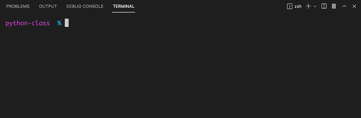
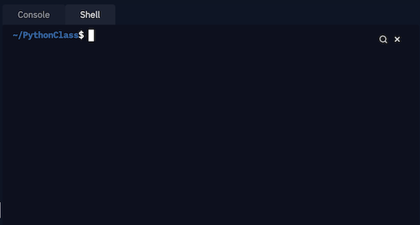
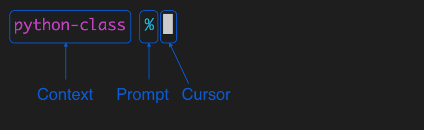
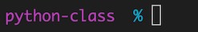

---
jupytext:
  formats: md:myst
  text_representation:
    extension: .md
    format_name: myst
kernelspec:
  display_name: Python 3
  language: python
  name: python3
substitutions:
  ctrltick: <kbd class="kbd docutils literal notranslate">⌃`</kbd>
---
Terminal
========

> A brief tour of the command line on a terminal.


```{contents} Table of Contents
:backlinks: top
:local:
```

Introduction
------------

We've talked about the {term}`Python shell` -- it is an interface where you can
type in python code, and it will run it and print out the results.

When people use the term {term}`console`, {term}`command line`,
{term}`terminal` or {term}`shell`, they usually mean the {term}`Operating System Shell`.

The command line uses a {term}`shell` scripting language like {term}`bash`,
{term}`zsh` or {term}`PowerShell` to interact with the the underlying
operating system.

Part 1: The terminal
--------------------

While the term "terminal" is often used synonomously with
"the {term}`command line`", it actually refers to the application that you run
to get to the command line.

Or, in the case of a terminal embedded in a suite of developer tools such as VS
Code or Repl.it, it refers the terminal part of the application.

### 1.1: Starting a terminal

`````{tab-set}

```{tab-item} VS Code

To open and focus the shell, click the {guilabel}`Terminal` tab (usually in the
bottom panel) or use the {{ ctrltick }} keyboard shortcut.

:::{admonition} Reminder
:class: tip

You can collapse or expand the sidebar with the keyboard shortcut {kbd}`⌘B` or
{kbd}`⌃B` and you can maxamize the bottom panel by clicking the {guilabel}`^`
symbol in the upper right corner. You might want to do so for this lesson.

:::

You should see something like this:



```

```{tab-item} Repl.it

To open and focus the shell, click the {guilabel}`Shell` tab in the right-most panel.

:::{admonition} Reminder
:class: tip

You can collapse or expand the sidebar by clicking the selected icon (the file
icon, by default) and you can resize or collapse panes by clicking and dragging
the bar between panes. You might want to collapse all other panes for the
remainder of this lesson.

:::

You should see something like this:



```

```{tab-item} OS

:::::{tabs}

:::{tab} MacOS

1. Open the launchpad by clicking the  icon in the dock or using the {kbd}`F4` keyboard shortcut.
2. Type the first few letters of `terminal` until the {guilabel}`Terminal` app is selected.
3. Press {kbd}`Enter`.

:::

:::{tab} Windows

1. Open the Start Menu by clicking the {fa}`windows` icon from the taskbar or pressing the {fa}`windows` key.
2. Type the first few letters of `powershell` until the {guilabel}`Windows PowerShell` app is selected.
3. Press {kbd}`Enter`.

:::

:::::

```

`````

### 1.2: The Prompt

Even when looking at a blank prompt, there may be a lot going on. Lets take a look.



* **Contextual information** -- typically this defaults to current directory,
  but may include other information such as any active virtual environment.
* **Prompt symbol** -- a symbol that indicates the end of the prompt. `bash`
  uses `$`, `zsh` uses `%` and `PowerShell` uses `>`.
* **Cursor** -- indicates the position where your text will go when you type.
    (This may vary depending on the system.) On most systems the cursor will
    change style when the terminal is not focused, such as outlined as pictured
    here:

    

In this and other lessons, a `$` is used to indicate the prompt in command line
example code. Any lines not starting with a `$` are the output of a command.

Part 2: Command line tour
-------------------------

### 2.1: Commands and arguments

Every command that you run on the terminal is really just a program. For
example, try the `date` command, which prints the current date and time.

```{code-block} console
:caption: command line
:class: full-width
$ date
Thu Aug 19 04:45:47 MDT 2021
```

The `uname` command prints system information, by default the operating system
name.

```{code-block} console
:caption: command line
:class: full-width
$ uname
Darwin
```

The `echo` command is very similar to the Python `print()` command--it prints
any arguments that follow to the screen, followed by a newline.

On the command line, arguments are seperated by spaces and quotes are usually
not needed. In this example, we'll use the `echo` command with one argument:
`Hello.`.

```{code-block} console
:caption: command line
:class: full-width
$ echo Hello.
Hello
```

Another example of a program is `python`, which, without any arguments starts a Python shell.

```{code-block} console
:caption: command line
$ python
Python 3.8.1 (default, Jun  4 2021, 23:47:23)
[Clang 12.0.5 (clang-1205.0.22.9)] on darwin
Type "help", "copyright", "credits" or "license" for more information.
Python initialized. Welcome.
>>>
```

If we provide a filename argument to `python` it will execute the code in that
file. In this example we'll run the program `python` with the argument
`hello.py`. This will run the file `hello.py` in the
{term}`working directory` if it exists.

```{code-block} console
:caption: command line
$ python hello.py
hello
```

Since spaces are used to seperate arguments, this can cause problems if a
filename that includes spaces. (Which is one of the reasons that's not
recommended.)

Imagine we have a file named `hello world.py`. If we try to run the file the
normal way, `python` will get two arguments: `hello` and `world.py`. Python
will look for a file `hello` first, and exit with an error message when it is
not found.

```{code-block} console
:caption: command line
$ python hello world.py
python: can't open file 'hello': [Errno 2] No such file or directory
```

To avoid this we can enclose the filename in single or double quotes.

```{code-block} console
:caption: command line
$ python "hello world.py"
Hello world!
```

Many programs take {term}`flags <flag>` or {term}`options <option>`, which are
special arguments that start with a dash (`-`).

Short options start with a single dash followed by a single character. For
example, the `date` command takes a `-u` flag which tells `date` to use UTC
instead of the local timezone.

```{code-block} console
:caption: command line
$ date -u
Sat Aug 21 23:12:33 UTC 2021
```

Some commands allow short options to be combined together. For example, the
`uname` uses the `-s` flag to print operating system name and the `-r` flag to
print the release, which can be passed two seperate arguments.

```{code-block} console
:caption: command line
$ uname -s -r
Darwin 20.3.0
```

As a shorthand, we can combine the two as `-sr` or `-rs`.

```{code-block} console
:caption: command line
$ uname -sr
Darwin 20.3.0
```

Long options start with two dashes followed by a human readable word. For
example, the `python` takes a `--version` option, which prints the Python
version.

```{code-block} console
:caption: command line
$ python --version
Python 3.8.1
```

Sometimes an option requires an argument. For example the `python` command
accepts the `-c` option to specify a Python statement to execute. Notice that
since the command contains both spaces and double quotes, it is enclosed in
single quotes.

```{code-block} console
:caption: command line
$ python -c 'print("oh hai")'
oh hai
```

Sometimes there is both a long and short version of the same option. For
example, to print the usage for `python` you can use either `-h` or `--help`.


#### Summary

* Commands on the command line are programs.
* Commands can take arguments, seperated by spaces. Single or double quotes are
  only needed to enclose arguments with spaces or other special characters.
* {term}`flags <flag>` or {term}`options <option>` are special arguments that
  start with a dash (`-`).
* Short options start with a single dash followed by a single character like:
  `-s`. Some programs allow you to combine multiple short options like: `-xyz`
  short for `-x -y -z`.
* Long options start with two dashes followed by a human readable word like:
  `--long`.
* The commands:
  * `echo` -- print to screen
  * `date` -- show date and time
  * `python` -- execute Python code
  * `uname` -- display system information

### 2.2: Getting Help

Many programs, including `python`, take a `-h` or `--help` option which will
show usage information about that particular program, usually including the
available options.

```{code-block} console
:caption: command line
$ python --help
Python 3.8.1
usage: python [option] ... [-c cmd | -m mod | file | -] [arg] ...
Options and arguments (and corresponding environment variables):
-b     : issue warnings about str(bytes_instance), str(bytearray_instance)
         and comparing bytes/bytearray with str. (-bb: issue errors)
-B     : don't write .pyc files on import; also PYTHONDONTWRITEBYTECODE=x
-c cmd : program passed in as string (terminates option list)
...
```

You can also get information about most programs using the `man` command, which
prints manual pages (man pages). Use the `man` command followed by the name of
the program.  For example, to get the manual page for the `man` program, use
`man man`.

The man page may be displayed using a pager program used for scrolling through
long documents like `less`. Most pager programs use {kbd}`SPACE` to scroll and
{kbd}`q` to exit. The man page for `man` should tell you what, if any, pager is
used, then you can look up the man page for the pager program.

```{code-block} console
:caption: command line
:class: full-width
$ man man
man(1)                                                                                                    man(1)

NAME
       man - format and display the on-line manual pages

SYNOPSIS
       man  [-acdfFhkKtwW]  [--path]  [-m  system]  [-p  string]  [-C  config_file] [-M pathlist] [-P pager] [-B
       browser] [-H htmlpager] [-S section_list] [section] name ...

DESCRIPTION
       man formats and displays the on-line manual pages.  If you specify section, man only looks in  that  sec-
       tion  of the manual.  name is normally the name of the manual page, which is typically the name of a com-
       mand, function, or file.  However, if name contains a slash (/) then man interprets it as a file specifi-
       cation, so that you can do man ./foo.5 or even man /cd/foo/bar.1.gz.

       See below for a description of where man looks for the manual page files.
...
```

Help information for commands provided by the shell is available via the `help`
program. Add the name of the command you want information about, or run help
with no arguments to get a list of shell commands.

```{code-block} console
:caption: command line
:class: full-width
$ help
Here is a list of topics for which special help is available:

alias          compcall       dot            functions      noglob         setcap         umask          zftp
autoload       compctl        echo           getcap         popd           setopt         unalias        zle
...

$ help echo
echo: echo [-neE] [arg ...]
    Write arguments to the standard output.

    Display the ARGs, separated by a single space character and followed by a
    newline, on the standard output.
...

$ help help
help: help [-dms] [pattern ...]
    Display information about builtin commands.

    Displays brief summaries of builtin commands.  If PATTERN is
    specified, gives detailed help on all commands matching PATTERN,
    otherwise the list of help topics is printed.

    Options:
      -d	output short description for each topic
      -m	display usage in pseudo-manpage format
      -s	output only a short usage synopsis for each topic matching
    		PATTERN
...
```

#### Summary

* Many programs will show usage information when a `-h` or `--help` option is
  passed. For example `python --help`.
* The `man` program can be used to view the man page for a particular
  program. For example, `man python`.
* The `help` program can be used to view usage information for shell builtin
  commands. For example `help echo`.

#### Exercise

`````{exercise} CLI Help Exercise
:label: cli-help-exercise

Find the flag for each of the following, then try using the command and flag.

1. Use the `man` program to see the man page for the `uname` program. What
   option is used to print the machine hardware name?
2. Use the `help` command to see the usage information for the `echo` command.
   What option is used to avoid adding a newline?
3. Run `python` with the `-h` option to view `python` usage information. What
   option is used to launch an interactive shell after running a script?

`````

`````{solution} cli-help-exercise
:class: dropdown

1. Use the `man` program to see the man page for the `uname` program. What
   option is used to print the machine hardware name?

   ```{code-block} console
   :emphasize-lines: "26-27"
   $ man uname
   UNAME(1)                                          User Commands                                         UNAME(1)

   NAME
       uname - print system information

   DESCRIPTION

       Print certain system information.  With no OPTION, same as -s.

       -a, --all
              print all information, in the following order, except omit -p and -i if unknown:

       -s, --kernel-name
              print the kernel name

       -n, --nodename
              print the network node hostname

       -r, --kernel-release
              print the kernel release

       -v, --kernel-version
              print the kernel version

       -m, --machine
           print the machine hardware name
   ...
   ```

   ```{code-block} console
   $ uname -m
   x86_64
   ```

2. Use the `help` command to see the usage information for the `echo` command.
   What option is used to avoid adding a newline?

   ```{code-block} console
   :emphasize-lines: "9-9"
   $ help echo
   echo: echo [-neE] [arg ...]
    Write arguments to the standard output.

    Display the ARGs, separated by a single space character and followed by a
    newline, on the standard output.

    Options:
      -n	do not append a newline
      -e	enable interpretation of the following backslash escapes
      -E	explicitly suppress interpretation of backslash escapes
   ...
   ```

   ```{code-block} console
   $ echo -n hello
   hello
   ```

3. Run `python` with the `-h` option to view `python` usage information. What
   option is used to launch an interactive shell after running a script?

   ```{code-block} console
   :emphasize-lines: "11-12"
   $ python -h
   usage: python [option] ... [-c cmd | -m mod | file | -] [arg] ...
   Options and arguments (and corresponding environment variables):
   -b     : issue warnings about str(bytes_instance), str(bytearray_instance)
            and comparing bytes/bytearray with str. (-bb: issue errors)
   -B     : don't write .pyc files on import; also PYTHONDONTWRITEBYTECODE=x
   -c cmd : program passed in as string (terminates option list)
   -d     : debug output from parser; also PYTHONDEBUG=x
   -E     : ignore PYTHON* environment variables (such as PYTHONPATH)
   -h     : print this help message and exit (also --help)
   -i     : inspect interactively after running script; forces a prompt even
            if stdin does not appear to be a terminal; also PYTHONINSPECT=x
   ...
   ```

   ```{code-block} console
   $ python -i hello.py
   hello
   >>> 
   ```

`````

### 2.3: Getting around

:::{important}

See also [paths lesson](paths#exploring-files-on-the-command-line).

:::

To find out where you are use the `pwd` command.

```{code-block} console
:caption: command line
:class: full-width
$ pwd
/Users/pythonclass
```

To list files use the `ls` command.

```{code-block} console
:caption: command line
:class: full-width
$ ls
file1 file2 file3

$ ls -l
$ ls -a
$ ls -A
$ ls -h
$ ls --color=always
```

To change directories use the `cd` command.

```{code-block} console
:caption: command line
:class: full-width
$ cd Documents
$ cd
$ cd -
$ cd -P
```

### 2.4: Getting file information

To get information about a file use the `file` command.

```{code-block} console
:caption: command line
:class: full-width
$ file null.png
null.png: PNG image data, 1200 x 904, 8-bit/color RGBA, non-interlaced

$ file README.md
README.md: HTML document text, UTF-8 Unicode text
```

Use the `wc` command to get word, line and character counts.

```{code-block} console
:caption: command line
:class: full-width
$ wc README.md
      64     184    2000 README.md

$ wc -l README.md
64 README.md
```

The `cat` command is intended for concatenating files, but it is also the
easiest way to show the entire contents of a file.

```{code-block} console
:caption: command line
:class: full-width
$ cat hello.txt
Hello python class!
```

Use the `less` command to scroll through a file.

```{code-block} console
:caption: command line
:class: full-width
$ less README.md
```

The `head` and `tail` commands can be used to show the beginning or end of a
file. The `-n` option can be used to specify the number of lines to show.

```{code-block} console
:caption: command line
:class: full-width
$ head README.md
Python Class
============

This repo is for the lessons and code related to the Python class that I've
been teaching to a few friends and family.

<h2 align="center"><a href="https://alissa-huskey.github.io/python-class/">» :book: Go to the lessons »</a>&nbsp;&nbsp;&nbsp;&nbsp;&nbsp;&nbsp;&nbsp;&nbsp;&nbsp;</h2>

Development Notes
-----------------


$ tail README.md
  * Branch: `gh-pages`
  * Folder: `/ (root)`
* Secrets & Deploy Key `ACTIONS_PAGES_DEPLOY_KEY`

<!-- references -->

[jb-pages]: https://jupyterbook.org/publish/gh-pages.html
[github-pages]: https://pages.github.com/
[github-actions]: https://github.com/features/actions
[actions-gh-pages]: https://github.com/peaceiris/actions-gh-pages
```


### 2.5: Making filesystem changes

To move a file use the `mv` command.

```{code-block} console
:caption: command line
:class: full-width
$ mv a b

$ mv -i a b

$ mv -n a b
```

To remove a file or directory use the `rm` command.

```{code-block} console
:caption: command line
:class: full-width

$ rm a
$ rm -I
$ rm -f
$ rm -r
```

To copy a file or directory use the `cp` command.

```{code-block} console
:caption: command line
:class: full-width
$ cp a b
$ cp -i a b
$ cp -r
$ cp -f

```

To create a directory use the `mkdir` command.

```{code-block} console
:caption: command line
:class: full-width
$ mkdir x
$ mkdir -p x
```

### 2.6: Text processing

Sort the contents of a file using the `sort` command.

```{code-block} console
:caption: command line
:class: full-width
$ sort x
$ sort -u x
$ sort -g x
$ sort -r
$ sort -R
```

Reference
---------

### Glossary

```{glossary} the-command-line

console
system console
  Comes from a time when early text-based computer systems with a keyboard and
  monitor interface were used to interact with servers or mainframes.  In
  modern usage people usually mean accessing the operating system's shell,
  usually with a terminal emulator. In repl.it, the right-most pane is referred
  to as the console.

shell
interactive shell
command line interpreter
operating system shell
  A text-based interface that runs code or command input. Operating systems
  have shells for system administration and operation such as Bash or Zsh in
  Unix-like systems or Powershell or the DOS Command Prompt in Windows. Some
  languages provide shells that execute code such as the Python Interactive
  Shell or the {abbr}`IRB (Interactive Ruby Shell)`.

terminal
terminal emulator
  In modern computing, an application that provides a text-based interface to
  the operating system's shell. Some examples include konsole and the Gnome
  Terminal in Unix-like systems, Terminal and iTerm2 on MacOs, and PuTTY,
  Cygwin mintty, the Windows Console, and the Windows Terminal for Windows.

  The term "console" and "terminal" are often used interchangaby, both
  historically to refer to a hardware server interface as well as the more
  modern colloquial meaning of accessing the operating system's shell.

command line
  In casual use, people usually mean accessing the operating system's shell,
  usually with a terminal emulator. See also, {term}`console`,
  {term}`terminal`.

flag
  A command line option that toggles on or off some feature. For example flags
  to enable or disable color might be: `--color` and `--no-color`. See also
  {term}`option`.

option
  A special kind of command line argument that starts with a dash.
```

### See also

:::{seealso}

* [LinuxCommand.org](http://linuxcommand.org/index.php)
* [Learn Enough Command Line to Be Dangerous](https://www.learnenough.com/command-line-tutorial/basics)
* [POSIX Specification](https://pubs.opengroup.org/onlinepubs/9699919799/)
* [Unix core command index](https://www.pixelbeat.org/docs/unix_commands/)

:::


----

% TODO
% [ ] startup files
% [ ] customizing prompts
% [ ] syntax: variables
% [ ] less
% [ ] windows pager
% [ ] windows git bash
% [ ] alternate terminal programs
% [ ] redirection & piping
% [ ] globbing

