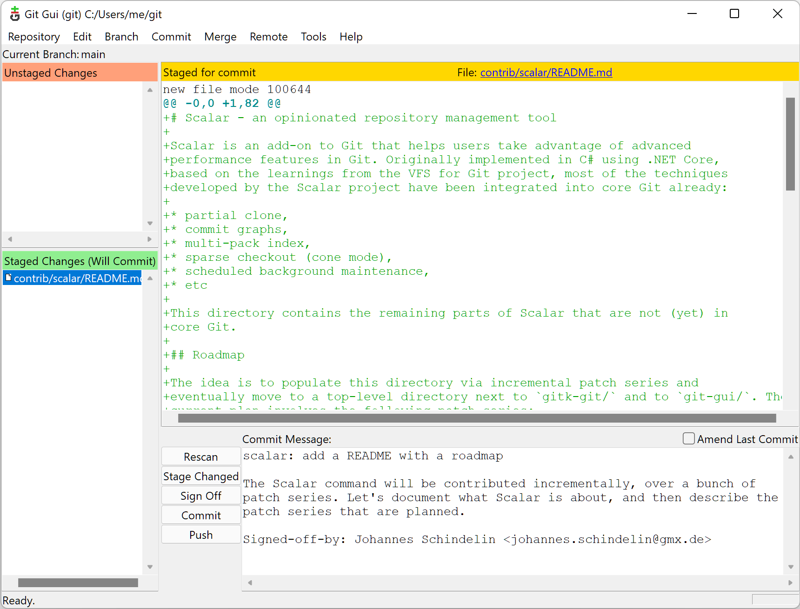
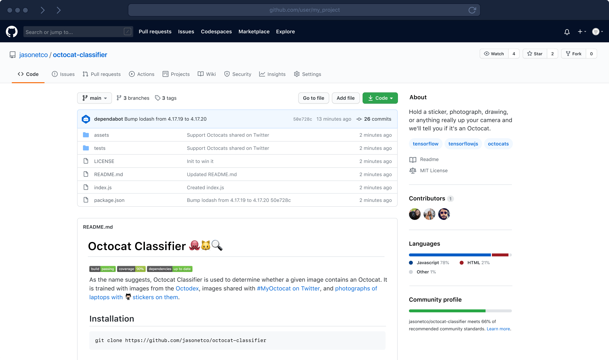
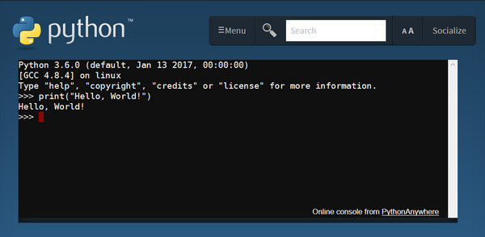

---
jupytext:
  formats: md:myst
  text_representation:
    extension: .md
    format_name: myst
kernelspec:
  display_name: Python 3
  language: python
  name: python3
---
Windows Dev Env for Python
==========================

Windows tool recommendations and setup guide for Python development.

```{include} ../toc.md
```

Part 1: Discord
---------------

{{ leftcol }}

Discord is a messaging app that is especially good for groups. It is how we
primarily gather via voice for classes. We also use the text chat to keep in
touch and share links, and occasionally use the screen sharing for
troubleshooting.

{{ rightcol }}


{{ endcols }}

1. Sign up for an account on [Discord](https://discord.com/) if you don't already have one.
1. Install the [Discord](https://discord.com/download) app on both your computer and phone.
1. Ask for an invitation to the QCC Discord channel.

Part 2: Git
-----------

{{ leftcol }}

Git is a tool we use for keeping track of the changes to any code we write over
time. This particular package, made for windows, also includes some tools that
will make your terminal experience more similar to the one on Mac or Linux
systems.

1. Install [git for windows](https://gitforwindows.org/).

{{ rightcol }}



{{ endcols }}

Part 2: Github
--------------

{{ leftcol }}

Github is a service for backing up and hosting your code and all of its
history.

1. Sign up for an account on [Github.com](http://github.com/).

{{ rightcol }}



{{ endcols }}

Part 3: Python
--------------

{{ leftcol }}

1. Install the {guilabel}`Latest Python 3 Release` of Python from [Python Releases for Windows](https://www.python.org/downloads/windows/).
   - Be sure to check the box {guilabel}`Add Python to PATH`.

{{ rightcol }}



{{ endcols }}

```{warning}

While Python is available in the Microsoft Store, the recommendation as of this
writing is to install from python.org.

The Microsoft Store version has certain limitations, has had reliability issues
in the past, and has some slight differences that may cause problems or
confusion.

```

```{seealso}

* [Using Python on Windows](https://docs.python.org/3/using/windows.html#)

```

% TODO
%
% - [ ] add to path
% - [ ] `py`, `py.exe`, `python`, `python.exe`, `pip`, `python3` from command line

Part 4: Visual Studio Code
--------------------------

{{ leftcol }}

Visual Studio code is a piece of software for writing code. It is the most
popular editor of its time due in part to the fact that it is approachable,
cross-platform, and works with any language. It also has collaboration features
that we rely on.

{{ rightcol }}


{{ endcols }}

### Part 2.1: Install

1. Install the latest version of [Visual Studio Code](https://code.visualstudio.com/docs?dv=win).

### Part 2.2: Settings

1. Open the command palette with the keyboard shortcut {kbd}`Ctrl+Shift+P`.
2. Type `settings` then hit the down arrow until {guilabel}`Preferences: Open Settings (JSON)` is selected then hit {kbd}`Enter`.
3. Paste the following into the file then save ({kbd}`Ctrl+S`).

```{literalinclude} windows-settings.json
:caption: settings.json
```

% TODO
% ----
%
% * `[ ]` extension pack


```{seealso}

* [VS Code Intro](vscode.md)
* [Visual Studio Code on Windows](https://code.visualstudio.com/docs/setup/windows)
* [How to set Git Bash as integrated terminal in VSCode in 2021](https://dev.to/andrewriveradev/how-to-set-git-bash-as-integrated-terminal-in-vscode-2k31)

```

% Part 5: Install python modules
% ------------------------------

% Part 6: Startup files
% ---------------------

% TODO
% ----
%
% * `[ ]` .zshrc / .bashrc
% * `[ ]` .env
